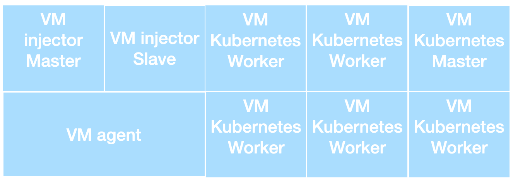
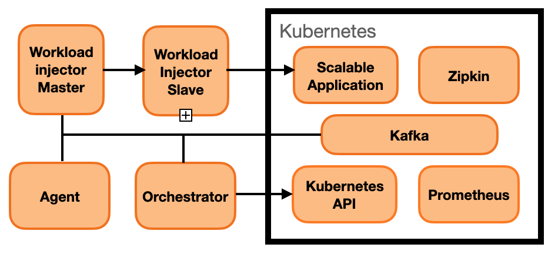
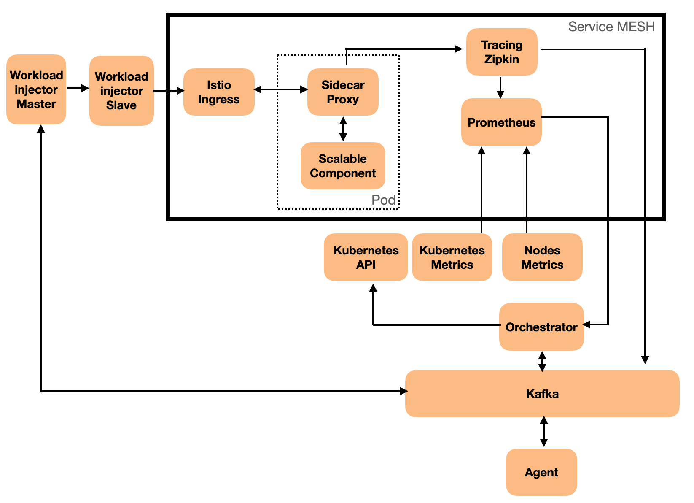

# Experimental Environment

This page describes the environment architecture used in the paper Horizontal scaling using Contextual Bandits.

## Low level architecture

The architecture is composed of 9 virtual machines running inside an Openstack Cloud. 

The two virtual machines "VM injector master" and "VM injector slave" has the following technical specs: 4 Vcpu/ 4 GB RAM/ 40 GB storage. These virtual machines will be used for workload injection.

The virtual machine "VM agent" has the following technical specs: 4 Vcpu/ 4GB RAM/40 GB storage. 4GB RAM is enough for evaluating reinforcement learning algorithms but 16GB RAM is prefered for real workload extraction/manipulation. This virtual machine will host the jupyter notebook evaluation code.

Six virtual machines is used to form a Kubernetes cluster. One virtual machine is dedicated as a Kubernetes Master and is tagged to not allowing pod execution. These virtual machines have the following specs: 8Vcpu/ 16GB RAM/ 40 GB storage.

All the virtual machines are interconnected through a unique private network and inter-communication are not filtered.

## General component view

From a component view, the architecture is composed of 9 components.

The "kafka" service is running inside the kubernetes cluster and is the core communication component allowing the components to inter-operate with each others.

The "workload injector master" and "workload injector slave" components are based on the Locust injection software. Each of these components are installed inside a dedicated virtual machine. The workload injector master component is listening for injection order on a dedicated Kafka topic and drives the workload injector slave component. The workload injector slave component injects HTTP requests on the scalable application and reports injection stats to the workload injector master component.

The "agent" and "orchestrator" components are installed inside the "agent" virtual machine. The agent component is a jupyter notebook running inside Jupyter Labs. The orchestrator component is a multi-threaded python script which collects metrics and send scale orders to the kubernetes API.

The "Prometheus" and "Zipkin" components are running inside the Kubernetes Cluster. These components collects respectively the virtual machines/Kubernetes system metrics and the latency traces.

The "scalable application" component is a pure experimental component developped in python. This component is running inside an Apache HTTP Server docker image. This component realizes some array manipulations and the number of array manipulations is specified in the client HTTP request. The more array computations the more consumed CPU.

## Detailed component view

A service MESH based on the ISTIO framework has been installed inside the kubernetes cluster.

The prometheus and nodes metrics components are installed by default with the ISTIO service MESH. Prometheus has been configured to scrape (collect) system metrics every 5 seconds at the Kubernetes level (Kubernetes Metrics) and at the virtual machines level (Nodes metrics).

The zipkin component is also installed by default with ISTIO. The default zipkin implementation collects the latency traces and stores them inside an internal traces database. This implementation has been changed to not store the latency traces in a database but instead to send every latency traces to a dedicated kafka topic. In our implementation the zipkin sampling has been set to 100% (captures all http requests latency)

The "istio ingress" service is installed by default with the ISTIO service MESH and is the entry-point for accessing a component inside the service MESH. In this implementation the "scalable component" is accessed through a sidecar proxy. This sidecar proxy secures the communication and send the latency traces to the zipkin service.

The agent, inside a jupyter labs service is interacting with two components through dedicated kafka topics. The first one is the "workload injector master" component on which the agent can set the injection level. The second one is the orchestrator component. The agent interacts with the orchestrator to retrieve a context view and to scale the scalable application in Kubernetes.

The orchestrator component, every 5 seconds, collects system metrics (CPU and RAM requests and Limits) on the Prometheus service and computes the mean for these metrics over all currently allocated containers. The computed means are then stored inside an history buffer of 10 entries. The orchestrator component is also listening for Zipkin traces on a Kafka topic. When a new zipkin trace is available, this trace is kept in its raw form inside an history buffer of 4000 entries (one entry per trace). All the buffer size are dynamically tunable but these values was the one used in the paper.

Every simulated user injected by the workload components are always sending the same HTTP request to the scalable component and waits for a random waiting time (between 0 and 2 seconds) before sending a new HTTP request.

## Overall operation

The agent component sends an order to the workload injector master service through a kafka topic to start the injection. The workload injector master then sends instruction to the workload injector slave to start the injection with the specified number of users. Each users sends the same HTTP requests to the istio ingress component. The istio ingress then routes the request to the scalable component istio-proxy sidecar. The istio-proxy sidecar marks a timestamp on the HTTP request and forwards the request to the scalable component. The scalable component performs some array computations specified in the HTTP request Query-String and responds to the istio-proxy sidecar. The istio-proxy sidecar marks the response timestamp, computes the request duration (latency) and sends the response to the istio ingress. The istio-proxy sends the overall traces which contains the request duration to the Zipkin service. The Zipkin service then sends the trace on a Kafka topic. The orchestrator component collects the trace on the kafka topic and insert it inside its history buffer. Each injected users then wait for a random time between 0 and 2 seconds and the overall process is repeated again. At any time the agent can change the number of injected users emulating a workload change.

When the agent asks the orchestrator, through a kafka topic, for a context view, the orchestrator component  is computing, from the history buffer, the 95th percentile latency and the number of requests per second within a 10 seconds time window. For the system metrics the mean of the CPU and RAM requests and limits are computed on the last 10 entries of the history buffer. The context vector is so : 

xt = [number of containers, 95th percentile latency, requests per second, cpu request mean, cpu limit mean, ram request mean, ram limit mean]

When the agent asks the orchestrator for a change on the number of container, the order is sent on a kafka topic. The orchestrator can change the number of containers in two ways (incremental or fixed). In incremental mode, the agent asks the orchestrator to increase or decrease the number of components with a specified step. In fixed mode, the agent asks the orchestrator to set a specified number of components. For the two modes (incremental or fixed) the orchestrator takes care of resource limits (min and max component number). These limits can be defined with a dedicated order on the kafka topic. The orchestrator then commit the modification on the Kubernetes API and waits for the system metrics (prometheus) to reflect the change. 
