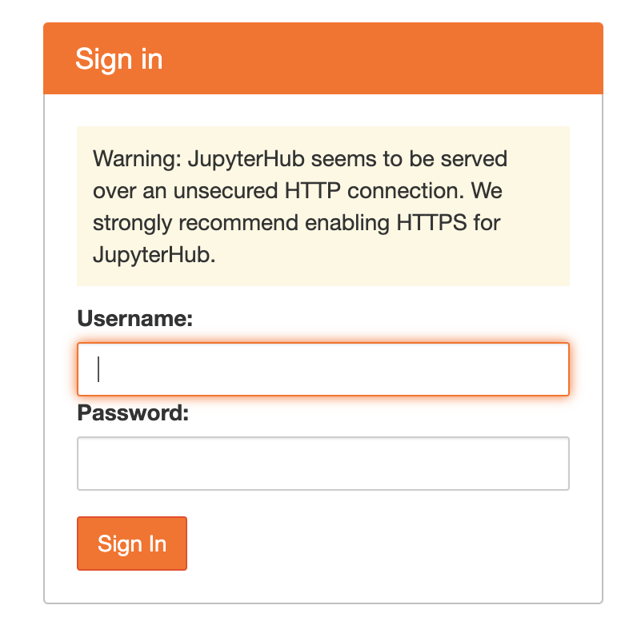

# Environment installation

An Ansible playbook and roles is available for a complete environment installation on a real Cloud platform. This installation procedure will create network, security group, ssh key, virtual machines and deploy the full environment.

For environment installation you need 7 virtual machines with the following specs:

Agent: 4 VCPU/16 GB RAM/40GB storage

Injector 1&2: 4VCPU/4GB RAM/40 GB storage

Kubernetes 1&2&3&4: 8VCPU/16 GB RAM/40 GB storage

This installation procedure has been only tested on: Debian 9, Ubuntu 18_04 and Ubuntu 20_04

3 playbooks are available:

- create_virtual_machines.yml: This playbook will create network, router, security group, ssh key and virtual machines on an Openstack Cloud. For executing this playbook the local machine needs to have a direct connection to the Openstack Apis.
- create_ansible_inventory.yml: This playbook will create the ansible inventory file: hosts.yml. For executing this playbook the local machine needs to have a direct connection to the Openstack Apis.
- deployment.yml: This playbook will deploy all components on the virtual machines. For executing this playbook the local machine needs to have a direct ssh connection with the kubernetes master server virtual machine (Openstack Apis are not used in this playbook). For provisioning the others virtual machine, ansible will bounce on the kubernetes master server virtual machine.

If your Cloud is based on the Openstack solution you can use the 3 provided playbooks. If your Cloud provider is based on a different technology (i.e: AWS) you have to manually create the infrastructure and use the playbook deployment.yml.


## Environment and installation constraints

Only the kubernetes master server virtual machine must have direct internet access through a dedicated floating IP. Others virtual machine does not need internet access has an HTTP proxy will be installed on the kubernetes master virtual machine.

The communication must not be filtered between virtual machine. On Openstack you can create a unique security group for all virtual machine which allows full inbound communication for the security group itself only. As you will need to access services on the virtual machine you can add your own IP address in this security group.

This installation procedure is so not secure and must be performed by a competent person with good knowledge of security implication. This must not be installed in sensible aera where environment is strategic. We cannot and will not be liable for any loss or damage arising from this installation procedure. 

## Supported Cloud architecture

Depending on the Cloud provider, the way to obtain a floating ip on an external network can change. A public Cloud and a private Cloud provider also implements different restrictions to access the Internet network and the Openstack Apis.

For the execution of the playbook "create_virtual_machines.yml" and "create_ansible_inventory.yml", the ansible machine has to be able to connect directly on the Openstack Apis as the following:


In all the following figures, the playbook "create_virtual_machine.yml" will create the green objects and the private network. The blue objects are already provided by the Cloud provider.

Architecture 1:

In this architecture a router is created with a default gateway on an external network. The external network is the one on which floating ip can be allocated. Only a floating ip is allocated on the virtual machine "master 1". The virtual machine "master1" is the only one allowed to directly access the Internet through its floating ip. The other virtual machine will use an HTTP Proxy on the virtual machine "master1" to access Internet package. Ansible and/or the client use the virtual machine "master1" to bounce on other virtual machines. Ansible and the client has to be directly connected to the Internet network for the "deployment.yml" playbook execution . 


Architecture 2:

This architecture is the same as the architecture 1 excepts that an "external router" is provided by the Cloud provider. This router allows internal project to connect to the Internet. 


Architecture 3:

Some Cloud Provider ( generally a private Cloud or inside an intranet) does not allow direct Internet connection. The virtual machine has to use an external HTTP Proxy to access Internet package. In this case the HTTP Proxy on the virtual machine "master1" is configured to chain with this external HTTP Proxy. As the virtual machine "master1", even with a floating ip, is not directly connected to the Internet network, the ansible and/or client machine has to be installed on the external organization network ( the network in where the floating ip on the virtual machine "master1" is reachable) in order to be able to execute the playbook "deployment.yml".


Architecture 4:

This architecture is the same as architecture 3 excepts that an "external router" is provided by the Cloud provider. As in architecture 3, the client and/or ansible machine has to be installed on the external organization network.


## Installation workflow

This is the overall steps to follow in order to create the environment:

- Install your ansible machine

- Identify your Cloud environment architecture from the previous section and fill the configuration file.
- Manually create the ressource (if you prefer or if you are not using an Openstack Cloud) or automatically create the infrastructure with the playbook "create_virtual_machines.yml"
- Manually fill the ansible inventory file "hosts.yml" and the ssh config file "ssh_hslinucb.config"  (if you prefer or if you are not using an Openstack Cloud) or automatically create these files by executing the playbook "create_ansible_inventory.yml"
- Check ssh connectivity
- Deploy the environment by executing the playbook "deployment.yml" 
- Test the environment

## Installation steps

### Ansible installation on local machine

Executes the following command to install ansible on your local machine:

```
# wget https://repo.anaconda.com/archive/Anaconda3-2020.07-Linux-x86_64.sh

# chmod +x Anaconda3-2020.07-Linux-x86_64.sh

# bash ./Anaconda3-2020.07-Linux-x86_64.sh -b -p /home/cloud/anaconda

# /home/cloud/anaconda/bin/conda init

# source ~/.bashrc

# conda update -y conda

# conda create --name ansible python=3.7

# conda activate ansible

# pip install ansible==2.10.2

# ansible-galaxy collection install openstack.cloud

# pip install openstacksdk==0.52.0
```
If running on Mac OS X
```
# pip install passlib
```


### Configuration file

To start the environment installation performs the following steps:

1- Connect with ssh on the ansible machine which has access to the Openstack Apis

2- git clone our repository and go under the directory HSLinUCB

3- Edit the file configuration.yml

- Fill the Cloud authentication informations:

`cloud_auth:`

 `auth_url: <http url to openstack authentication API>`

 `username: <openstack user name>`

 `password: <openstack password>`

 `#user_domain_id: <openstack user domain id>`

 `#user_domain_name: <openstack user domain name>`

 `#domain_id: <openstack domain id>`

 `#project_id: <openstack project id>`

 `#project_name: <openstack project name>`

Uncomment or comment the relevant variable for your Cloud Provider.

- Change the private network adresss:

`private_network_cidr: "192.168.1.0/24"`

The private network address has to be in CIDR format.

- Change the DNS server used on the private network:

`private_network_dns_server: "8.8.8.8"`

If you need to enter more than one DNS server, separate these IP with a comma. 

In our implementation, only the virtual machine "master1" will use this DNS. The other virtual machines will use the virtual machine "master1" as DNS server.

- If your Cloud provider brings an existing router (architecture 02 or 04) set its name here or leave the field blank

`CloudRouterName: "<existing router name>"`

- If a route has to be created to an external network set the external network name or leave the field blank:

`external_network_name: "<floating ip external network>"`

- Set the Ips list authorized to access the virtual machine "master1"

`external_authorized_ip: ["1.2.3.4/32","5.6.7.8/32"]`

If the ansible machine which will be used later to execute the playbook "deployment.yml" is the same as the future environment client machine enter only the Ip address of this machine. If the ansible and the future environment client machines are different enter the two Ips address. The Ips address has to be entered in CIDR format.

- If your virtual machine has to use an external HTTP Proxy to access Internet package enter its IP address or its DNS name. Leave the field blank if an external HTTP Proxy is not mandatory.

`external_http_proxy: "http://myproxy:8080"`

Note: In our implementation, the squid proxy, running on the virtual machine "master1", will be configured to chain with this external proxy without any authentication. If your external HTTP Proxy requires authentication you have to modify the squid configuration template.

- Fill the virtual machine specifications for agent, stress, master and worker and save the configuration file.
- Specify the login and password that will be used for JupyterLab access

`jupyterlab_account:`

  `- user:`

​    `login: <login>`

​    `password: <password>`

WARN: this login will be created as a Linux user on the virtual machine "agent1" so choose a strong password.

- Encrypt the configuration file:

Once the configuration file is filled, as this file contains sensitive informations, it's a good practice to encrypt this file.

`ansible-vault encrypt configuration.yml`

Note: Do not forget the password as there is no way to retrieve it.

- Check Cloud authentication

Try to authenticate on the Openstack Apis by executing the following command:

`ansible-playbook check_connection.yml -e "@configuration.yml" --ask-vault-pass`

If this playbook raises an error, checks the connectivity between the ansible machine and the Openstack Apis and checks the authentication informations in the configuration file.

To edit the encrypted configuration file:

`ansible-vault edit configuration.yml`

### Create the resources

Execute the following command to create the network, router, security group, virtual machines:

`ansible-playbook create_virtual_machines.yml -e "@configuration.yml" --ask-vault-pass`

The created ssh private key will be stored in the file: hslinucb_ssh.key

Note: If the Cloud resources were manually created, place the ssh private key content in the file hslinucb_ssh.key

### Create the ansible inventory

Execute the following command to create the ansible inventory:

`ansible-playbook create_ansible_inventory.yml -e "@configuration.yml" --ask-vault-pass`

This will update the file "hosts.yml" and the ssh configuration file "ssh_hslinucb.config"

Note: If the Cloud resources were manually created, update the "hosts.yml" and "ssh_hslinucb.config" files with the relevant informations.

### Test ssh connectivity

Executre the following command to test the ssh connection on each virtual machine:

`ssh -F ssh_hslinucb.config master1`

`ssh -F ssh_hslinucb.config agent1`

`ssh -F ssh_hslinucb.config worker1`

`ssh -F ssh_hslinucb.config worker2`

`ssh -F ssh_hslinucb.config worker3`

`ssh -F ssh_hslinucb.config stress1`

`ssh -F ssh_hslinucb.config stress2`

If the ssh connection failed, checks the ssh connectivity of the local machine with the virtual machine "master1" floating ip. Also try to connect without the ssh configuration file:

`ssh -i hslinucb_ssh.key <ssh user>@<master1 floating ip>`

If the connection succeed, checks the content of the ssh configuration file.

### Environment deployment

If the ansible machine used to create the resources is not the same as the one uses for deployment ( due to ssh connectivity issue), copy the following files on the ansible deployment machine: hslinucb_ssh.key, ssh_hslinucb.config

Execute the following command to deploy the environment: 

```
ansible-playbook -i hosts.yaml deployment.yml
```

The kubernetes certificate and configuration files will be stored in the directory: files.hslinucb

### Environment test

Once the installation finished you can access the environment portal with a browser on:

http://<master1 floating ip>

The following interface is displayed:


Prometheus and grafana links give access to these tools.

The locust link gives access to the locust http interface


This locust interface can be used to display charts during injection run or download injection reports.

The JupyterHub Agent link gives access to the JupyterHub instance on the virtual machine "agent1"



To log in the jupyterlab service uses the credential defined in the configuration file "configuration.yml" in the section jupyterlab_account


The kubernetes kubectl command is available and can be use from every virtual machines
